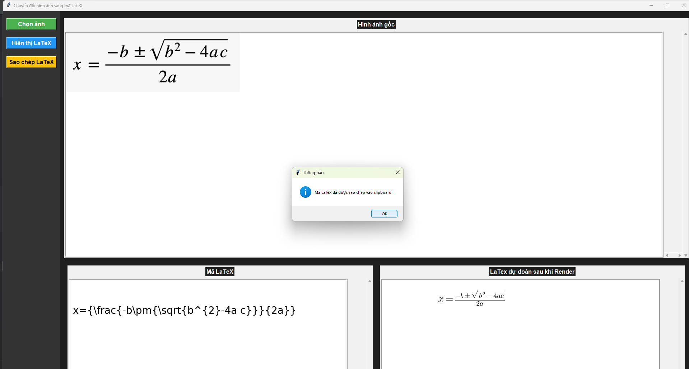

# **Im2LaTex - Chuyển đổi hình ảnh công thức toán học sang LaTex**
> Thành viên nhóm: [**Đại Nguyễn**](https://github.com/pistachioc), [**Đức Phạm**](https://github.com/CharliePham141)
> 
> Đây là project môn học, mọi thứ còn sơ khai và nhiều thiếu sót, mong các thí chủ chỉ giáo và lượng thứ
> 
> Lời cảm ơn đặc biệt đến quý ngài [***Lukas Blecher***](https://github.com/lukas-blecher) vì project này tham khảo chỉnh từ của ngài
> 

## [1. Về project](#project)

Mục tiêu của dự án này là tạo ra một công cụ có thể lấy hình ảnh của công thức toán học và trả về mã LaTeX tương ứng.


## [2. Thiết lập môi trường](#moitruong)

Sử dụng [Visual Code](https://code.visualstudio.com/download), [PyCharm](https://www.jetbrains.com/pycharm/download/?section=windows), [Spyder](https://www.spyder-ide.org/) để chạy project

Sử dụng [Anaconda](https://www.anaconda.com/download/success) để tạo Conda bat hoặc tạo Virtual Enviroment với base Python 3.9.11

Tiếp theo, sử dụng terminal với Interpreter đã tạo, chạy lệnh sau để cài các package cần thiết

```pip install requirements.txt```

## [3. Model và dữ liệu](#model)
* Bài toán sử dụng tham khảo từ các papers, sử dụng model bao gồm thành phần Vision Transformer là thành phần encoder sử dụng BackBone ResNet và Transformer model là thành phần decoder
* Dữ liệu cho bài toán sử dụng là các công thức toán học và các mã LaTex tương ứng: [*Im2LaTex-100K*](https://www.kaggle.com/datasets/shahrukhkhan/im2latex100k), [*CROHME 2016*](https://tc11.cvc.uab.es/datasets/ICFHR-CROHME-2016_1)


## [4.  Đánh giá](#performance)
|                                  Dataset                                   | BLEU score | normed edit distance | token accuracy |
|:--------------------------------------------------------------------------:|:----------:|:--------------------:|:--------------:|
|    [CROHME 2016](https://tc11.cvc.uab.es/datasets/ICFHR-CROHME-2016_1)     |   0.786    |        0.264         |     0.675      |   
| [Im2LaTex-100K](https://www.kaggle.com/datasets/shahrukhkhan/im2latex100k) |   0.899    |        0.075         |     0.690      |


## [5. Tham khảo](#Ref)
[1] [An Image is Worth 16x16 Words](https://arxiv.org/abs/2010.11929)

[2] [Attention Is All You Need](https://arxiv.org/abs/1706.03762)

[3] [LaTexOCR](https://pix2tex.readthedocs.io/en/latest/)

[4] [Image-to-Markup Generation with Coarse-to-Fine Attention](https://arxiv.org/abs/1609.04938v2)

[5] [*pix2tex - LaTexOCR*](https://github.com/lukas-blecher/LaTeX-OCR)


